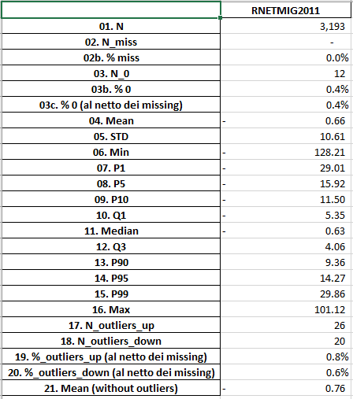
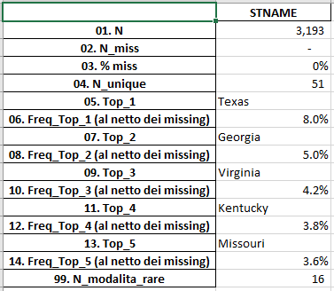
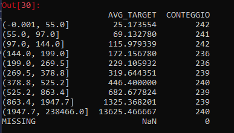

# Encoreds - Data Quality

The module data\_quality in encoreds contains some useful functions that can be used during the exploratory analysis performed on a new dataset, before developing a model.

Essentially, the functions contained in the module could be divided into three categories:

#### Data Description:

* **df\_data\_description\_cat\(dataset\)**: a function that performs a data description \(similar to pandas.describe\(\) with more informations\), on cathegoric columns
* **df\_data\_description\_num\(dataset\)**: a function that performs a data description \(similar to pandas.describe\(\) with more informations\), on numeric columns
* **dict\_data\_description\(dataset\)**: if you prefer to have the result in a dictionary format, rather than a pandas dataframe, both for numeric and cathegoric columns
* **write\_excel\_data\_description\(dataset, filename\)**: if you want to write an excel file with the output of the data descriptions on numeric and cathegoric columns

#### Stability:

* **psi\(expected\_array, actual\_array\)**: function that calculate the Popolation Stability Index \(PSI\) between the distributions of expected\_array and actual\_array, when in the arrays are contained numeric variables
* **my\_cat\_psi\(expected\_array, actual\_array\)**: function that calculate the Popolation Stability Index \(PSI\) between the distributions of expected\_array and actual\_array, when in the arrays are contained cathegoric variables
* **compute\_df\_psi\(data\_expected, data\_actual\)**: function that calculate the PSI between every column of data\_expected and data\_actual and returns the result in a pandas DataFrame
* **compute\_dict\_psi\(data\_expected, data\_actual\)**: function that calculate the PSI between every column of data\_expected and data\_actual and returns the result in a dictionary
* **write\_excel\_psi\(data\_expected, data\_actual, filename\)**: if you want to write an excel file with the output of the PSI computed on all columns in data\_expeced and data\_actual

#### Univariate Analysis:

* **univariate\_df\(df\_in, x, y\)**: function that split in deciles \(or classes\) the x variable in dataset df\_in, and compute the average value of target variable y in each decile; it returns a dataframe where the index column is composed by the deciles or classes and in the values there are the mean values of target variable and the count of observations for each class
* **univariate\_chart\(df\_in, x, y\)**: function that has the scope to produce a chart with in x axis the index of the dataframe returned by the function above \(deciles of x variable\), in the first y axis the average value of target \(y\) variable through deciles and in the second y axis the counting of obs; the avg of target variable is drawn as a red line chart, while the counting as a blue bar chart
* **get all\_univariate\_chart\(df, y\)**: function that produces all the univariate charts of each column of df chosen as x variable against y variable. Note: y must be a column of df
* **get\_ppscore\(df, x, y\)**: function that returns the Power Predictive Score \[a synthetic score which ranges between 0 and 1\] of x predicting y
* **get\_all\_ppscore\(df, y\)**: function that returns a dictionary with all Power Predictive Scores of each column of df against y target variable

In the following you are able to find a simple tutorial about how to use these functions and how they could be really useful in the exploratory analysis while developing a predictive model.

### Data Description

Functions in this cathegory have the purpose of getting an idea about the structure of the dataset and the distributions of the various columns.

Below you can find a code snippet to understand how to call each function. We used the census.csv free dataset you can download form [here](https://github.com/rashida048/Datasets/blob/master/census.csv). 

```python
import pandas as pd
from encoreds.data_handling import data_quality

path_to_file = 'datasets/census.csv'

# reading census
census = pd.read_csv(path_to_file)

# writing the output excel file with data descriptions of all columns 
# (one sheet for numeric columns, one sheet for cathegoric)
outfile = 'outputs/census_description.xlsx'
data_quality.write_excel_data_description(census, outfile)

# writing the output excel file with data descriptions of all columns 
# (one sheet for each column)
outfile2 = 'outputs/census_description_v02.xlsx'
data_quality.write_excel_data_description(census, outfile2, 
                                          one_var_per_sheet=True)

# if you are interested in the description of only a restricted number of columns:

# Result in DataFrame
desc_state = data_quality.df_data_description_cat(census, var = ['STNAME'])
desc_births = data_quality.df_data_description_num(census, 
                                                   var = ['BIRTHS2011', 
                                                          'RBIRTH2011'])

# Result in dict (can handle both numeric and cathegoric)
desc_dict = data_quality.dict_data_description(census, var = ['STNAME', 
                                                              'BIRTHS2011'])
```

An example of the output excel, for **numeric columns** is:



For **cathegoric columns**:



#### Examples of usefulness

For numeric columns:

* **number** and **percentage** of **missing** and of **zeros** \(special values\): a field with a high percentage of missing values is not a good feature for a model and it is advisable to exclude it or to decide a smart way of missing inputation \(example: using the median value for each city, or region, if available, ...\)
* **detailed distribution**: instead of pandas.describe\(\), which returns only the median value and the quartiles, here we can get in a fast way also some interesting percentiles \(1st, 5th, 10th, 90th, 95th, 99th\), in order to have a detailed idea of the distribution also in the tails, which can lead to an unbalanced model, if not handled correctly
* **Number** and **percentage** of **outliers** \(and Mean without outliers\): getting the number and the percentage of outliers _\[by default, the cutoff to consider an observation an outlier is 3Quart + 3\*interquartile\_range\]_  is useful because it allows to understand if there is a consistent number of out-of-scale observations. This problem can be handled with a non-linear scaling/standardization or with the exclusion of the column from the model.

For cathegoric columns:

* **number** and **percentage** of **missing** values: as above for numeric columns
* **number** of **unique** values - useful for the decision of the **encoding** of the cathegoric variables _\[Label Encoder vs One-Hot\]_
* **number** of **rare values** _\[by default the % to decide whether an observation is rare is 1%\]_  - also useful to decide how to aggregate the values for the encoding
* **distribution** \(number and percentage of obs\) for the **most frequent classes** _\[by default 5 class\]_

### Stability

Functions in this cathegory have the purpose of calculating the stability between two distributions in the form of the Population Stability Index defined as follows:

$$
\text{PSI}(p, q, N)=\sum_{i=1}^N (p_i - q_i) \times \left( \log \frac{p_i}{q_i} \right)
$$

where $$N$$ is the number of bins over which the domain is split, $$p_i$$ and $$q_i$$ are the empirical probabilities of the samples $$p$$ and $$q$$ respectively to belong to bin $$i$$ . The PSI can also be written as the symmetrized KL-divergence between the two distributions:

$$
D^*(p\Vert q) = D_\text{KL}(p\Vert q) + D_\text{KL}(q\Vert p)
$$

We refer to this [PhD thesis](https://scholarworks.wmich.edu/cgi/viewcontent.cgi?article=4249&context=dissertations) for more details.

The PSI is useful for example when **developing a model**: after dividing the dataset in **train set** and **test set**, it is advisable \(mandatory?\) to check whether the variables have similar distributions within the train set and the test set. If that does not happen, it is highly recommended to exclude that variable from the training of the model \(or maybe the splitting in train set and test set has to be changed\).  
Another application is with a **deployment code** that is running regularly on new data provided by the clients. It is recommended to check whether the distributions of the model variables are similar to the ones expected \(for example to the ones of the previous months\). If that does not happen, there should be a log telling us what is going wrong \(probably clients' data have changed, are corrupted, and we may advice them about it\).

The **cutoffs** for judging whether a variable is stable are the following:

* if a variable has a **psi greater than 0.25**, it means that it is **not stable at all** and some **major changes** have occurred; 
* if a variable has a **psi between 0.1 and 0.25**, it means that **it is not very stable** and some **minor changes** have occurred.  
* On the other hand, if the **psi is smaller than 0.1**, that means the two distributions are **stable** in time and only neglegible fluctuations have occurred.

```python
import pandas as pd
from encoreds.data_handling import data_quality
from sklearn.model_selection import train_test_split

path_to_file = 'datasets/census.csv'

# reading census
census = pd.read_csv(path_to_file)

# PSI between Train and Test [all columns]
Train, Test, y_train, y_test = train_test_split(census, census.DEATHS2015)
outfile_psi = 'tutorials/output_psi.xlsx'
data_quality.write_excel_psi(Train, Test, outfile_psi)

# if you want the rwsult in a dict:
dict_psi = data_quality.compute_df_psi(Train, Test)

# if you want the result in a df:
df_psi = data_quality.compute_df_psi(Train, Test)

# PSI between two arrays (numeric)
psi_birth_11_12 = data_quality.psi(Train.BIRTHS2011, Train.BIRTHS2012)

# PSI between two arrays (cathegoric)
psi_STATE =  data_quality.my_cat_psi(Train.STNAME, Test.STNAME)
```

The dataframe in output has the following shape:


If you are interested in a detailed analysis of the PSI and all its potentiality, please have a look to the following gitbook: [here](https://app.gitbook.com/@ammagamma/s/models-and-solutions-templates/data-quality/population-stability-index).

### Univariate analysis

The functions here could be used during the **procedures of Feature Selection**, in order to have a measure \(through a **synthetic KPI** or watching a **chart**\) of the relation between the target variable and the all possible x variables.

There is also the posibility to get the average of the target variable grouped by the deciles \(or classes\) of the x variable and get the result in a dataframe \(for example, if you do not want the chart but you prefer to write te results in an excel file, ...\)

```python
# PPSCORE of x predicting y
pps_1 = data_quality.get_ppscore(Train, 'DEATHS2011', 'DEATHS2015')
pps_2 = data_quality.get_ppscore(Train, 'DEATHS2012', 'DEATHS2015')

# PPSCORE of a series of x predicting y
dict_pps = data_quality.get_all_ppscore(Train, 'DEATHS2015', 
                                        x = ['DEATHS2011', 
                                             'DEATHS2012', 
                                             'DEATHS2013', 
                                             'DEATHS2014'])

# GET ALL the PPSCORES in a dictionary
dict_pps_complete = data_quality.get_all_ppscore(Train, 'DEATHS2015')

# write a chart
data_quality.univariate_chart(Train, 'DEATHS2011', 'DEATHS2015')

# write charts of a series of vars
data_quality.get_all_univariate_chart(Train, 'DEATHS2015', 
                                      x = ['DEATHS2011', 
                                           'DEATHS2012', 
                                           'DEATHS2013', 
                                           'DEATHS2014'],
                                      outpath = 'outputs/charts/')

# write all charts
data_quality.get_all_univariate_chart(Train, 'DEATHS2015', 
                                      outpath = 'outputs/charts/')

# if you do not want the chart:
df_out = data_quality.univariate_df(Train, 'DEATHS2011', 'DEATHS2015')
```

If you are interested in knowing more about the Power Predictive Score: [https://towardsdatascience.com/rip-correlation-introducing-the-predictive-power-score-3d90808b9598](https://towardsdatascience.com/rip-correlation-introducing-the-predictive-power-score-3d90808b9598)

Finally, below you can have a look to the output of the univariate\_df:



Written by Filippo Miti

Use this at your own risk!

