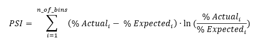

# Population Stability Index

This code snippet has the purpose to check if in two datasets **the distributions** of the variables are **stable** or not.  
It is useful for example when **developing a model**: after dividing the dataset in **train set** and **test set**, it is advisable \(mandatory?\) to check whether the variables have similar distributions within the train set and the test set. If that does not happen, it is highly recommended to esclude that variable from the training of the model \(or maybe the splitting in train set and test set has to be changed\).  
An other application is when we have a **deployment code** that is running regularly on new data from the clients. It is recommended to check whether the distributions of the model variables are similar to the ones expected \(for example to the ones of the previous months\). If that does not happen, there should be a log telling us what is going wrong \(probably clients' data have changed, are corrupted, and we may advice them about it\).

The **cutoffs** for judging whether a variable is stable are the following:

* if a variable has a **psi greater than 0.25**, it means that it is **not stable at all** and some **major changes** have occurred; 
* if a variable has a **psi between 0.1 and 0.25**, it means that **it is not very stable** and some **minor changes** have occurred.  
* On the other hand, if the **psi is smaller than 0.1**, that means the two distributions are **stable** in time and only neglegible fluctuations have occurred.

### Full Code​

```python
import logging
logging.basicConfig(
  format='%(asctime)s\t%(levelname)s\t%(message)s',
  #filename='default.log',
  level=logging.INFO
  #level=logging.DEBUG
  )

import pandas as pd
import numpy as np

# if you want to write excel file at the end, keep it True
write = True

def sub_psi(e_perc, a_perc):
  '''Calculate the actual PSI value from comparing the values.
     Update the actual value to a very small number if equal to zero
  '''
  if a_perc == 0:
    a_perc = 0.0001
  if e_perc == 0:
    e_perc = 0.0001

  value = (e_perc - a_perc) * np.log(e_perc / a_perc)
  return(value)

def scale_range (input, min, max):
  input += -(np.min(input))
  input /= np.max(input) / (max - min)
  input += min
  return input
    
def psi(expected_array, actual_array, buckets, buckettype = 'bins'):
  '''Calculate the PSI for a single variable
    Args:
       expected_array: numpy array of original values
       actual_array: numpy array of new values, same size as expected
       buckets: number of percentile ranges to bucket the values into
       buckettype: type of strategy for creating buckets, bins splits into even splits, quantiles splits into quantile buckets
    Returns:
       psi_value: calculated PSI value
  '''

  breakpoints = np.arange(0, buckets + 1) / (buckets) * 100

  if buckettype == 'bins':
    breakpoints = scale_range(breakpoints, np.min(expected_array), np.max(expected_array))
  elif buckettype == 'quantiles':
    breakpoints = np.stack([np.percentile(expected_array, b) for b in breakpoints])

  expected_percents = np.histogram(expected_array, breakpoints)[0] / len(expected_array)
  actual_percents = np.histogram(actual_array, breakpoints)[0] / len(actual_array)

  psi_value = np.sum(sub_psi(expected_percents[i], actual_percents[i]) for i in range(0, len(expected_percents)))

  return(psi_value)

def my_cat_psi(expected_array, actual_array):

    dic_exp = expected_array.value_counts().to_dict()
    dic_act = actual_array.value_counts().to_dict()
    keys = set(list(dic_exp.keys())) | set(list(dic_act.keys()))
    exp_hist = []
    act_hist = []
    for k in sorted(keys):
      exp_hist.append(dic_exp.get(k, 0)/len(expected_array))
      act_hist.append(dic_act.get(k, 0)/len(actual_array))
    psi_value = np.sum(sub_psi(exp_hist[i], act_hist[i]) for i in range(0, len(exp_hist)))
    return(psi_value)

def main():

  data = pd.read_csv(inputpath)
  data_old = pd.read_csv(path_to_old)

  dic_psi = {}
  for c in data.columns:
    logging.info(c)    
    if data[c].dtype in ['int64', 'float64']:
      dic_psi[c] = psi(data_old[c], data[c], buckets=10, buckettype = 'quantiles')
    else:
      dic_psi[c] = my_cat_psi(data_old[c], data[c])
        
  df_psi = pd.DataFrame.from_dict(dic_psi, orient = 'index')
  df_psi = df_psi.reset_index().rename(columns = {'index' : 'campo', 0: 'stability_index'})

  if write:
    df_psi.to_excel(path_clienti + 'report_analisi_stabilita.xlsx', index = False)

if __name__ == '__main__':
  main()  
```

### Step by step procedure

* Initial import and configurations. Switch write = True if you want the output in an excel file

```python
import logging
logging.basicConfig(
  format='%(asctime)s\t%(levelname)s\t%(message)s',
  #filename='default.log',
  level=logging.INFO
  #level=logging.DEBUG
  )

import pandas as pd
import numpy as np

# if you want to write excel file at the end, keep it True
write = True
```

* Functions that compute the **Population Stability Index** \(PSI\) for a **continuous variable** \(int or float\)



* _Remark 1_: The PSI is given by the above formula, where n\_of\_bins is the number of classes you want to divide your distributions, % Actual\_i represents the percentage of actual \(new\) observations in class i and % Expected\_i represents the percentage of expected \(old\) observations in class i. 
* _Remark 2_: The split in bins could be done in two ways:
  * if buckettype = 'bins', the distribution is splitted according to the value that the expected distribution has \(through the function scale\_range\)
  * if buckettype = 'quantile', the distribution is splitted in order to obtain the same number of observation in each class \(in the expected distribution\)

```python
def sub_psi(e_perc, a_perc):
  '''Calculate the actual PSI value from comparing the values.
     Update the actual value to a very small number if equal to zero
  '''
  if a_perc == 0:
    a_perc = 0.0001
  if e_perc == 0:
    e_perc = 0.0001

  value = (e_perc - a_perc) * np.log(e_perc / a_perc)
  return(value)

def scale_range (input, min, max):
  input += -(np.min(input))
  input /= np.max(input) / (max - min)
  input += min
  return input
    
def psi(expected_array, actual_array, buckets, buckettype = 'bins'):
  '''Calculate the PSI for a single variable
    Args:
       expected_array: numpy array of original values
       actual_array: numpy array of new values, same size as expected
       buckets: number of percentile ranges to bucket the values into
       buckettype: type of strategy for creating buckets, bins splits into even splits, quantiles splits into quantile buckets
    Returns:
       psi_value: calculated PSI value
  '''

  breakpoints = np.arange(0, buckets + 1) / (buckets) * 100

  if buckettype == 'bins':
    breakpoints = scale_range(breakpoints, np.min(expected_array), np.max(expected_array))
  elif buckettype == 'quantiles':
    breakpoints = np.stack([np.percentile(expected_array, b) for b in breakpoints])

  expected_percents = np.histogram(expected_array, breakpoints)[0] / len(expected_array)
  actual_percents = np.histogram(actual_array, breakpoints)[0] / len(actual_array)

  psi_value = np.sum(sub_psi(expected_percents[i], actual_percents[i]) for i in range(0, len(expected_percents)))

  return(psi_value)
```

* Functions that compute the **Population Stability Index** \(PSI\) for a  **cathegorical variable** \(object\). In this case, the classes we check the stability are essentially the cathegories

```python
def my_cat_psi(expected_array, actual_array):

    dic_exp = expected_array.value_counts().to_dict()
    dic_act = actual_array.value_counts().to_dict()
    keys = set(list(dic_exp.keys())) | set(list(dic_act.keys()))
    exp_hist = []
    act_hist = []
    for k in sorted(keys):
      exp_hist.append(dic_exp.get(k, 0)/len(expected_array))
      act_hist.append(dic_act.get(k, 0)/len(actual_array))
    psi_value = np.sum(sub_psi(exp_hist[i], act_hist[i]) for i in range(0, len(exp_hist)))
    return(psi_value)
```

* Main function:
  * Data\_old is supposed to be the dataset with the expected distribution \(dataset where we have developped the model, train set, dataset of the previous month, ...\)
  * If write = False \(ie: you do not want the output file excel\), you can get the dataframe df\_psi with all the variables and their PSI within the two datasets

```python
def main():

  data = pd.read_csv(inputpath)
  data_old = pd.read_csv(path_to_old)

  dic_psi = {}
  for c in data.columns:
    logging.info(c)    
    if data[c].dtype in ['int64', 'float64']:
      dic_psi[c] = psi(data_old[c], data[c], buckets=10, buckettype = 'quantiles')
    else:
      dic_psi[c] = my_cat_psi(data_old[c], data[c])
        
  df_psi = pd.DataFrame.from_dict(dic_psi, orient = 'index')
  df_psi = df_psi.reset_index().rename(columns = {'index' : 'campo', 0: 'stability_index'})

  if write:
    df_psi.to_excel(path_clienti + 'report_analisi_stabilita.xlsx', index = False)
```

### Final thoughts / recommendation <a id="final-thoughts--recommendation"></a>

This code snippet needs to be completed, for example with some triggers, written in the log or sent by notifications/email to the Data Scientist / Developer / PM or directly to the client. 

Created by Filippo Miti

