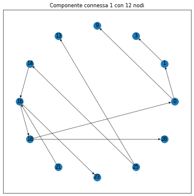

# Connected Components on Graphs

This code finds and plots the connected components of a \(directed\) graph.

## Output and Full Code​



```python
import networkx as nx, matplotlib.pyplot as plt, pandas as pd

G = nx.gnp_random_graph(30,.02,directed=True)

G_ = G.to_undirected()
CC = [G.subgraph(c) for c in nx.connected_components(G_)]

df_dimensions = pd.DataFrame([len(g.nodes) for g in CC],columns=['dimension']).reset_index().sort_values('dimension',ascending=False)
 
for i,d in df_dimensions[['index','dimension']].values:
    c = CC[i]
    fig, ax = plt.subplots(figsize=(8,8),dpi=50)
    pos = nx.shell_layout(c)
    nx.draw_networkx_nodes(c, pos, with_labels=True, ax=ax)
    nx.draw_networkx_edges(c, pos,alpha=.7)
    nx.draw_networkx_labels(c,pos, font_size=12,font_color='k')
    ax.set_facecolor('white')
    ax.set_title(f'Componente connessa {i+1} con {d} nodi')
    plt.show()
```

## Details

df\_dimensions is a DataFrame with the dimensions of each connected component and it is sorted by descending dimension.

### Step by step procedure

* Step 1. Import of the libraries.

  ```python
  import networkx as nx, matplotlib.pyplot as plt, pandas as pd
  ```

* Step 2. For this example we use on a graph randomly generated: 30 nodes, 2% probability to create an edge between two nodes and we want it directed \(the edges have a direction\).

  ```python
  G = nx.gnp_random_graph(30,.02,directed=True)
  ```

* Step 3. To compute the connected components we first need to turn the graph undirected \(the connected components do not depend on the feature directed/undirected\). Next, we use the connected\_components API to create the list of all components: CC. Each of this component is a \(directed\) subgraph of G.

  ```python
  G_ = G.to_undirected()
  CC = [G.subgraph(c) for c in nx.connected_components(G_)]
  ```

* Step 4. To understand better the dimension of these components a DataFrame is created. It will have two columns: index, which is the index of the component in the list CC, and dimension, which is the number of nodes in that component. 

  ```python
  df_dimensions = pd.DataFrame([len(g.nodes) for g in CC],columns=['dimension']).reset_index().sort_values('dimension',ascending=False)
  ```

* Step 5. Each component is showed in a shell layout.

  ```python
  for i,d in df_dimensions[['index','dimension']].values:
      c = CC[i]
      fig, ax = plt.subplots(figsize=(8,8),dpi=50)
      pos = nx.shell_layout(c)
      nx.draw_networkx_nodes(c, pos, with_labels=True, ax=ax)
      nx.draw_networkx_edges(c, pos,alpha=.7)
      nx.draw_networkx_labels(c,pos, font_size=12,font_color='k')
      ax.set_facecolor('white')
      ax.set_title(f'Componente connessa {i+1} con {d} nodi')
      plt.show()
  ```


## Final thoughts / recommendation

If the graph is very big maybe you do not want to plot each connected component.

If some component is really big maybe it's better make the plot bigger or change the layout.

Use this at your own risk!

