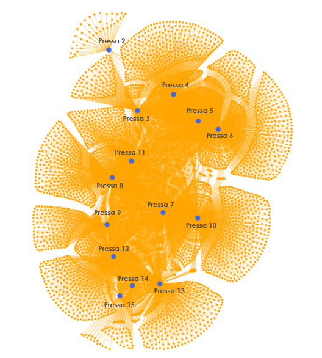
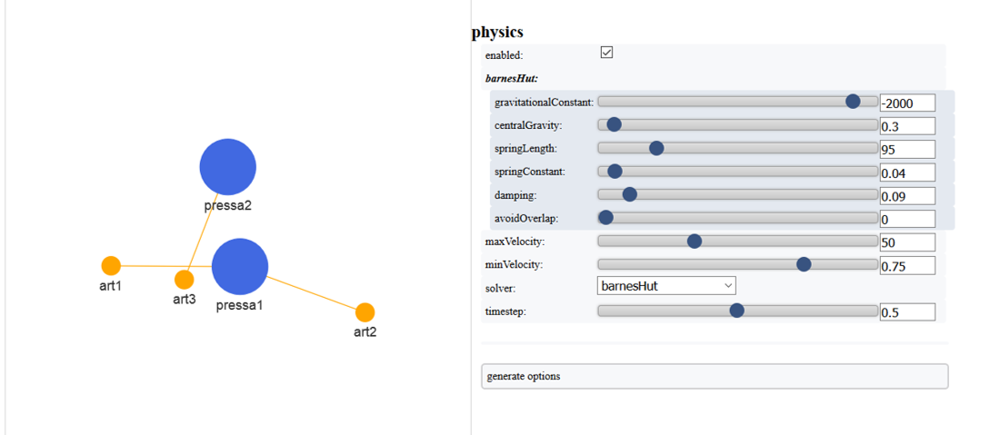

# PyVis physical graph

The following example is a graph for the study of combinations between machines and articles of a moulding industry.

The graph is build on PyVis, a rather unknown library about graphs that allow to set physics rules to build complex graphs scenarios and allow a partial modelation through a manual interface.

### Output and Full Code



```python
from pyvis.network import Network

net = Network(notebook=False)

articoli_totali = ['art1', 'art2', 'art3']
macchine = ['pressa1', 'pressa2']

comb_articolo_pressa_c = [('art1', 'pressa1'), ('art2', 'pressa1'), ('art3', 'pressa2')]

net.add_nodes(articoli_totali, value = [10 for a in articoli_totali], color=["orange" for a in articoli_totali])
net.add_nodes(macchine, label=macchine, value=[100 for m in macchine], color=["royalblue" for m in macchine])

net.add_edges(comb_articolo_pressa_c)

net.show_buttons(filter_=['physics', 'nodes', 'edges'])
net.show("comb_totali.html")
```

### Details

La potenzialità principale di PyVis consiste nella possibilità di creare grafi interattivi, dinamici e modificabili tramite parametri fisici, con un'ottima resa spaziale. Possibilità di modificare il grafico tramite interfaccia grafica da pagina html.

#### Step by step procedure

**Step 1**. Creazione dell'oggetto grafo. Passandogli `notebook=True`, permette di visualizzare il grafo direttamente dal notebook, ma perdendo l'interfaccia grafica per modificare le fisiche \(vd. di seguito\).

```python
from pyvis.network import Network
net = Network(notebook=False)
```

**Step 2**. Aggiunta nodi: sono semplici liste. I colori sono inseribili tramite formato CSS. Aggiunta archi: sono tuple a due elementi. 

Piccolo bug: gli elementi nelle tuple devono essere dello stesso tipo, e non si riesce a passargli numeri convertiti in stringhe: li riconverte in float. Quindi o tutto in numeri, o creare stringhe con delle parole all'interno.

```python
articoli_totali = ['art1', 'art2', 'art3']
macchine = ['pressa1', 'pressa2']

comb_articolo_pressa_c = [('art1', 'pressa1'), ('art2', 'pressa1'), ('art3', 'pressa2')]

net.add_nodes(articoli_totali, value = [10 for a in articoli_totali], color=["orange" for a in articoli_totali])
net.add_nodes(macchine, label=macchine, value=[100 for m in macchine], color=["royalblue" for m in macchine])

net.add_edges(comb_articolo_pressa_c)
```

**Step 3**. Lancio del grafo e setting della dashboard di modifica dei parametri. Qui la funzionalità più interessante. show\_buttons crea un'interfaccia grafica per regolare il settaggio delle fisiche che regolano il comportamento dei nodi \(`'physics'`\). Con `'nodes'` e `'edges'` si possono regolare colori e forme di nodi e archi, ma solo se essi sono già tutti dello stesso tipo \(stesso colore e dimensione\) `.show()` crea la pagina html in cui viene visualizzato il tutto.

```python
net.show_buttons(filter_=['physics', 'nodes', 'edges'])
net.show("comb_totali.html")
```



Created by: Francesco Carelli

