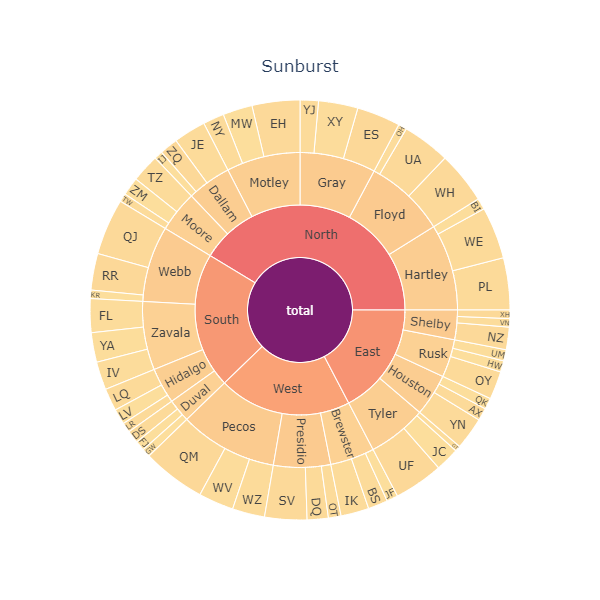

# Plotly Sunburst plot

Show hierarchical visualization of a DataFrame, like a multiple level pie plot. 

## Output and Full Code​



```python
import plotly.graph_objects as go, plotly_express as px
import pandas as pd

def build_hierarchical_dataframe(df, levels, value_column, color_column=None):
    """
    Description

    Parameters
    ----------
    df : pandas DataFrame
    levels : list
        List of columns used to create hierarchy for the plot
    value_column : string
        Column used for values to show at each level of the hierarchy
    color_column : string, default 'Heatmap'
        Optional, used to color the plot according to this additional column

    Returns
    -------
    Build a hierarchy of levels for Sunburst or Treemap charts.

    Levels are given starting from the bottom to the top of the hierarchy,
    ie the last level corresponds to the root.
    """
    df_all_trees = pd.DataFrame(columns=['id', 'parent', 'value', 'color'])
    for i, level in enumerate(levels):
        df_tree = pd.DataFrame(columns=['id', 'parent', 'value', 'color'])
        dfg = df.groupby(levels[i:]).sum()
        dfg = dfg.reset_index()
        df_tree['id'] = dfg[level].copy()
        if i < len(levels) - 1:
            df_tree['parent'] = dfg[levels[i+1]].copy()
        else:
            df_tree['parent'] = 'total'
        df_tree['value'] = dfg[value_column]
        df_tree['color'] = dfg[color_column]
        df_all_trees = df_all_trees.append(df_tree, ignore_index=True)
    total = pd.Series(dict(id='total', parent='',
                              value=df[value_column].sum().sum(),
                              color=df[color_column].sum().sum()))
    df_all_trees = df_all_trees.append(total, ignore_index=True)
    average_score  = df[color_column].sum().sum()
    return df_all_trees, average_score

def plot_sunburst(df, levels, value_column, color_column, title='Sunburst', figsize=500, filename=''):
    """
    Description

    Parameters
    ----------
    df : pandas DataFrame
    levels : list
        List of columns used to create hierarchy for the plot
    value_column : string
        Column used for values to show at each level of the hierarchy
    color_column : string, default 'Heatmap'
        Optional, used to color the plot according to this additional column
    title : string, default 'Heatmap'
        Plot title
    figsize : int, default 500
        Dimension of the square image (figsize, figsize)
    filename : string, default ''
        Name of the filaname. If filename != '' then the image 
        is saved with the filename specified. 
        Supported formats:
        - png (static image)
        - html (interactive image)

    Returns
    -------
    Plotly image
    """
    df_all_trees, average_score = build_hierarchical_dataframe(df, levels, value_column, color_column)

    fig = go.Figure()
    fig.add_trace(go.Sunburst(
        labels=df_all_trees['id'],
        parents=df_all_trees['parent'],
        values=df_all_trees['value'],
        branchvalues='total',
        marker=dict(
            colors=df_all_trees['color'],
            colorscale=px.colors.sequential.Sunsetdark,
#             cmid=average_score
        ),
        hovertemplate='<b>%{label} </b> <br> '+value_column+': %{value}<br> '+color_column+': %{color:.2f}',
        name=''
        ))

    fig.update_layout(
        autosize=False,
        width=figsize,
        height=figsize,
        title={'text':title,'x':.5,'y':.9},
    )

    if filename.endswith('.html'):
        fig.write_html(filename)
    elif filename.endswith('.png'):
        fig.write_image(filename)

    fig.show()


df = pd.read_csv('https://raw.githubusercontent.com/plotly/datasets/master/sales_success.csv')
levels = ['salesperson', 'county', 'region'] # levels used for the hierarchical chart from outer to inner in the plot
value_column = 'sales'
color_column = 'calls'

plot_sunburst(df, levels, value_column, color_column, figsize=600)
```

## Details

The code is composed by two function: the first one takes a DataFrame as input and create the hierarchy

### Step by step procedure

* Step 1. Import libraries

  ```python
  import plotly.graph_objects as go, plotly_express as px
  import pandas as pd
  ```

* Step 2. Define build\_hierarchical\_dataframe which takes a DataFrame as input and returns a new DataFrame organized in a hierarchical shape with the specified levels and value column. These values will be used to create the plot areas\(like in a pie plot\), according to the levels. It can be specified also the column to use to color the final plot. 

  ```python
  def build_hierarchical_dataframe(df, levels, value_column, color_column=None):
      """
      Description

      Parameters
      ----------
      df : pandas DataFrame
      levels : list
          List of columns used to create hierarchy for the plot
      value_column : string
          Column used for values to show at each level of the hierarchy
      color_column : string, default 'Heatmap'
          Optional, used to color the plot according to this additional column

      Returns
      -------
      Build a hierarchy of levels for Sunburst or Treemap charts.

      Levels are given starting from the bottom to the top of the hierarchy,
      ie the last level corresponds to the root.
      """
      df_all_trees = pd.DataFrame(columns=['id', 'parent', 'value', 'color'])
      for i, level in enumerate(levels):
          df_tree = pd.DataFrame(columns=['id', 'parent', 'value', 'color'])
          dfg = df.groupby(levels[i:]).sum()
          dfg = dfg.reset_index()
          df_tree['id'] = dfg[level].copy()
          if i < len(levels) - 1:
              df_tree['parent'] = dfg[levels[i+1]].copy()
          else:
              df_tree['parent'] = 'total'
          df_tree['value'] = dfg[value_column]
          df_tree['color'] = dfg[color_column]
          df_all_trees = df_all_trees.append(df_tree, ignore_index=True)
      total = pd.Series(dict(id='total', parent='',
                                value=df[value_column].sum().sum(),
                                color=df[color_column].sum().sum()))
      df_all_trees = df_all_trees.append(total, ignore_index=True)
      average_score  = df[color_column].sum().sum()
      return df_all_trees, average_score
  ```

* Step 3. Define the plot\_sunburst function which takes as input the DataFrame organized by levels in the hierarchical shape and returns a Plotly figure.

  ```python
  def plot_sunburst(df, levels, value_column, color_column, title='Sunburst', figsize=500, filename=''):
      """
      Description

      Parameters
      ----------
      df : pandas DataFrame
      levels : list
          List of columns used to create hierarchy for the plot
      value_column : string
          Column used for values to show at each level of the hierarchy
      color_column : string, default 'Heatmap'
          Optional, used to color the plot according to this additional column
      title : string, default 'Heatmap'
          Plot title
      figsize : int, default 500
          Dimension of the square image (figsize, figsize)
      filename : string, default ''
          Name of the filaname. If filename != '' then the image 
          is saved with the filename specified. 
          Supported formats:
          - png (static image)
          - html (interactive image)

      Returns
      -------
      Plotly image
      """
      df_all_trees, average_score = build_hierarchical_dataframe(df, levels, value_column, color_column)

      fig = go.Figure()
      fig.add_trace(go.Sunburst(
          labels=df_all_trees['id'],
          parents=df_all_trees['parent'],
          values=df_all_trees['value'],
          branchvalues='total',
          marker=dict(
              colors=df_all_trees['color'],
              colorscale=px.colors.sequential.Sunsetdark,
  #             cmid=average_score
          ),
          hovertemplate='<b>%{label} </b> <br> '+value_column+': %{value}<br> '+color_column+': %{color:.2f}',
          name=''
          ))

      fig.update_layout(
          autosize=False,
          width=figsize,
          height=figsize,
          title={'text':title,'x':.5,'y':.9},
      )

      if filename.endswith('.html'):
          fig.write_html(filename)
      elif filename.endswith('.png'):
          fig.write_image(filename)

      fig.show()
  ```

* Step 4

  ```python
  print(x)
  ```

* Step 5

  ```python
  print(x)
  ```

* Step 6

  ```python
  print(x)
  ```

* Step 7

  ```python
  print(x)
  ```

* Step 8

  ```python
  print(x)
  ```

* Step 9

  ```python
  print(x)
  ```

* Step 10

  ```python
  print(x)
  ```

## Final thoughts / recommendation

Use this at your own risk!

Created by: Alberto Manzini

