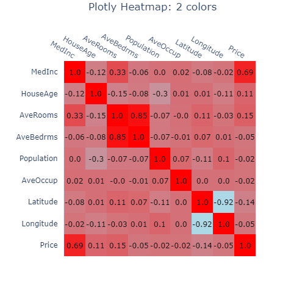
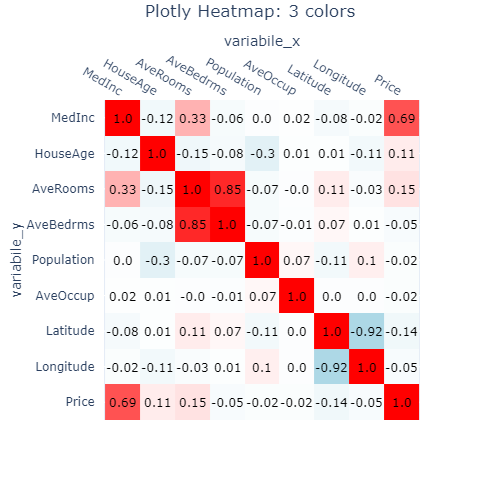

# Plotly Heatmap function

‌Create an Heatmap plot with Plotly library. The code is organized as a function which allow to create several different Heatmaps.

## Output and Full Code​


```python
import plotly.figure_factory as ff
import pandas as pd, numpy as np
from sklearn.datasets import fetch_california_housing

data = fetch_california_housing()
X, Y = data['data'], data['target']
X = pd.DataFrame(X,columns=data['feature_names'])
df = X.copy()
df['Price'] = Y


def plot_heatmap(df_heatmap, title='Heatmap', xaxis_title='', yaxis_title='', n_colors=1, figsize=500, filename=''):
    """
    Description

    Parameters
    ----------
    df_heatmap : pandas DataFrame
    title : string, default 'Heatmap'
        Plot title
    xaxis_title : string, default ''
        Name of the x axis
    yaxis_title : string, default ''
        Name of the y axis
    n_colors : {1, 2, 3}, default 1
        Number of colors to use in the Heatmap
    figsize : int, default 500
        Dimension of the square image (figsize, figsize)
    filename : string, default ''
        Name of the filaname. If filename != '' then the image 
        is saved with the filename specified. 
        Supported formats:
        - png (static image)
        - html (interactive image)

    Returns
    -------
    Plotly image
    """
    if n_colors == 1:
        colorscale = [[0, 'white'], [1, 'green']]
        font_colors = ['black', 'black']
    elif n_colors == 2:
        colorscale = [[0, 'lightblue'], [1, 'red']]
        font_colors = ['black', 'black']
    elif n_colors == 3:
        colorscale = [[0, 'lightblue'], [.5, 'white'], [1, 'red']]
        font_colors = ['black', 'black', 'black']
    fig = ff.create_annotated_heatmap(np.round(df_heatmap.values[::-1],2), 
                                      x = list(df_heatmap.columns),
                                      y = list(df_heatmap.index)[::-1],
                                      colorscale=colorscale, font_colors=font_colors)


    fig.update_layout(
        autosize=False,
        width=figsize,
        height=figsize,
        title={'text':title,'x':.5,'y':.99},
        xaxis_title=xaxis_title,
        yaxis_title=yaxis_title,
    )

    if filename.endswith('.html'):
        fig.write_html(filename)
    elif filename.endswith('.png'):
        fig.write_image(filename)

    fig.show()

plot_heatmap(df.corr(), title='Plotly Heatmap!')
```

## Details

The code is structured to be independent using the california\_housing dataset embedded in sklearn library. The ourput will be a Plotly interactive image. The code is structured as a function ready to be used.

Let's see how the code is organized step but step.

### Step by step procedure

* Step 1. Importing the libraries

  ```python
  import plotly.figure_factory as ff
  import pandas as pd, numpy as np
  from sklearn.datasets import fetch_california_housing
  ```

* Step 2. Importing data from sklearn. We will use california housing dataset. We gather inputs and output into a unique DataFrame which will be used to test the function.

  ```python
  data = fetch_california_housing()
  X, Y = data['data'], data['target']
  X = pd.DataFrame(X,columns=data['feature_names'])
  df = X.copy()
  df['Price'] = Y
  ```

* Step 3. Defining function and all its inputs, as specified in the description.

  ```python
  def plot_heatmap(df_heatmap, title='Heatmap', xaxis_title='', yaxis_title='', n_colors=1, figsize=500, filename=''):
      """
      Description

      Parameters
      ----------
      df_heatmap : pandas DataFrame
      title : string, default 'Heatmap'
          Plot title
      xaxis_title : string, default ''
          Name of the x axis
      yaxis_title : string, default ''
          Name of the y axis
      n_colors : {1, 2, 3}, default 1
          Number of colors to use in the Heatmap
      figsize : int, default 500
          Dimension of the square image (figsize, figsize)
      filename : string, default ''
          Name of the filaname. If filename != '' then the image 
          is saved with the filename specified. 
          Supported formats:
          - png (static image)
          - html (interactive image)

      Returns
      -------
      Plotly image
      """
  ```

* Step 4. Setting colors number, colorscale \(= background color\) and font\_colors \(= color of the annotations for the Heatmap\).

  ```python
      if n_colors == 1:
          colorscale = [[0, 'white'], [1, 'green']]
          font_colors = ['black', 'black']
      elif n_colors == 2:
          colorscale = [[0, 'lightblue'], [1, 'red']]
          font_colors = ['black', 'black']
      elif n_colors == 3:
          colorscale = [[0, 'lightblue'], [.5, 'white'], [1, 'red']]
          font_colors = ['black', 'black', 'black']
  ```

* Step 5. Create the Heatmap. Please note that the numbers are rounded to the second decimal. The order of the rows is reversed by the command \[::-1\] due to Plotly default settings.

  ```python
      fig = ff.create_annotated_heatmap(np.round(df_heatmap.values[::-1],2), 
                                        x = list(df_heatmap.columns),
                                        y = list(df_heatmap.index)[::-1],
                                        colorscale=colorscale, font_colors=font_colors)
  ```

* Step 6. Updating layout of the plot in terms of figure size \(squared: figsize x figsize\), plot title and axis titles.

  ```python
      fig.update_layout(
          autosize=False,
          width=figsize,
          height=figsize,
          title={'text':title,'x':.5,'y':.99},
          xaxis_title=xaxis_title,
          yaxis_title=yaxis_title,
      )
  ```

* Step 7. If filename argument is passed, the plot will be saved either as an html page or png file \(depending on filename extension\).

  ```python
      if filename.endswith('.html'):
          fig.write_html(filename)
      elif filename.endswith('.png'):
          fig.write_image(filename)
  ```

* Step 8. Show the figure created.

  ```python
      fig.show()
  ```

* Step 9. Use the function to plot the image shown above. In this case we plot the correlation matrix of the DataFrame using Pandas inner method and passing 'Plotly Heatmap!' string as plot title.

  ```python
  plot_heatmap(df.corr(), title='Plotly Heatmap!')
  ```

## Final thoughts / recommendation

This function can be used for different purposes, like confusion matrix, correlations,  try different argument values to test it.

See also: 

* [https://app.gitbook.com/@energyway/s/models-and-solutions-templates/datavis-miscellanea/plotly\_confusion\_matrix](https://app.gitbook.com/@energyway/s/models-and-solutions-templates/~/drafts/-M6jaj-x4VLj1-jEAnxe/datavis-miscellanea/plotly_confusion_matrix)

Example usage: two colors correlation matrix:

```python
plot_heatmap(df.corr(), n_colors=2, title='Plotly Heatmap: 2 colors')
```



```python
plot_heatmap(df.corr(), n_colors=3, title='Plotly Heatmap: 3 colors', 
             xaxis_title='variabile_x', yaxis_title='variabile_y')
```



Use this at your own risk!

Created by: Alberto Manzini

